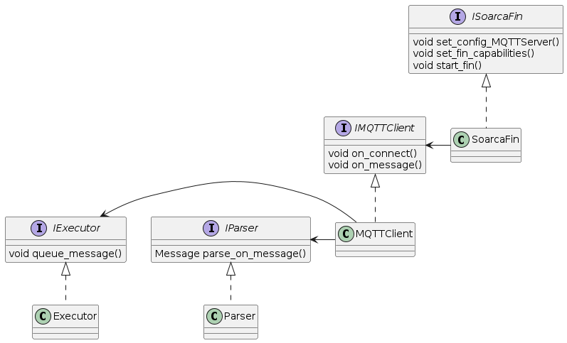
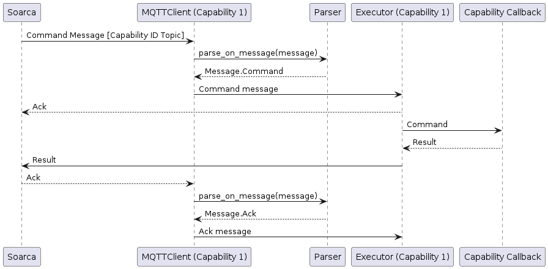
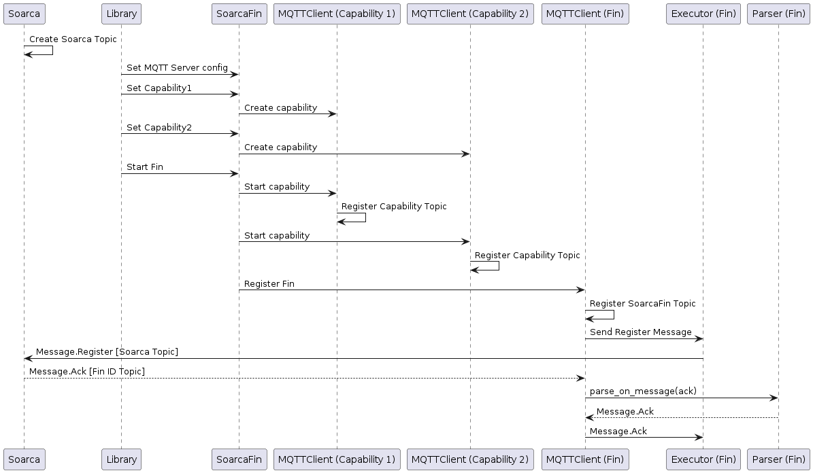

# SOARCA Fin Library
A Python implementation for the SOARCA FIN, compatible with: SOARCA the TNO orchestrator for Open-C2, CACAO and STIX
For more information about the SOARCA, we refer the reader to the [website](https://cossas.github.io/SOARCA/) of the SOARCA project.

## Quick Use
To use the SOARCA Fin library use the following command to install the library using pip:
```bash
pip install soarca-fin-library
```

## Setup SOARCA Capabilities
To register a fin to SOARCA, first create a `SoarcaFin` object and pass the `fin_id` in the constructor.
Call `set_config_MQTT_server()` to set the required configurations for the fin to connect to the MQTT broker.
For each capability to be registered, call `create_fin_capability()`. The capability callback funtion should return an object of type `ResultStructure`.
When all capabilities are initialized, call `start_fin()` for the SOARCA Fin to connect to the MQTT broker and register itself to SOARCA.

An example is given in this project in the file `soarca_fin_python_library/main.py`

## Running this repository
### Requirements
 - Python3
 - Poetry

### Setup
#### Env File
In order to run the project, create an `.env` file in the root of the project with the following entries:
```bash
MQTT_BROKER = "{INSERT_MQTT_BROKER_URL_HERE}"
MQTT_PORT = "{INSERT_MQTT_PORT_HERE}"
MQTT_USERNAME = "{INSERT_USERNAME_HERE}"
MQTT_PASSWD = "{INSERT_PASSWORD_HERE}"
```
If no `.env` file is specified, the following default values will be used:
```bash
MQTT_BROKER = "localhost"
MQTT_PORT = "1883"
MQTT_USERNAME = "soarca"
MQTT_PASSWD = "password"
```

#### Dependencies
To handle dependencies in this project, the package Poetry is used.
To install Poetry execute the following command:
```bash
pip3 install poetry
```

To install the dependencies from the `pyproject.toml` either enter a poetry shell, create a virtual environment or use poetry run.
To enter a poetry shell execute the following command in the root of the project:
```bash
poetry shell
```

To install the dependencies in a poetry shell or create a virtual environment, run:
```bash
poetry install
```


### Quick Run
To quick run the project, either run it through poetry run or a poetry shell.
#### Poetry Run
```bash
poetry run python soarca_fin_python_library/main.py
```

#### Poetry Shell
```bash
python soarca_fin_python_library/main.py
```


## Documentation
For documentation about the fin protocol we refer the reader to de documention page of [SOARCA](https://cossas.github.io/SOARCA/docs/soarca-extensions/fin-protocol/)

For class diagrams and example sequence diagrams of the Fin implementation [plantUML](https://plantuml.com/) is used.

### Application Layout
The main object of the application is the `SoarcaFin` object, which is responsible for configuring and creating and controlling the capabilities.
The SoarcaFin creates `MQTTClient`s for each capability registered, plus one for registering, unregistering and controlling the fin.
`MQTTClient`s each have their own connection to the MQTT Broker and own `Parser` and `Executor` objects.
The `Parser` object parsers the raw MQTT messages and tries to convert them to one of the objects in `src/models`.
The `Executor` runs in their own thread and handles the actual execution of the messages.
The `Executor` polls a thread-safe queue for new messages and performs IO operations, such as sending messages to the MQTT broker and calling capability callbacks.

### Class Overview


### Sequence Diagrams
#### Command


#### Register


## Contributing
Want to contribute to this project? Please keep in mind the following rules:
- This repository uses git **rebase** strategy
- For each PR, there should be atleasts one issue
- Make sure all tests pass (including lint errors)

### Running tests
To run the tests in this repository use:
```bash
poetry run python -m unittest
``` 
To run python linter, first install pylint and then run pylint with the following arguments:
```bash
poetry add pylint &&
poetry run pylint --disable=R,C $(git ls-files '*.py')
```
To format the code base, first install ruff and then run ruff:
```bash
poetry add ruff &&
poetry run ruff format
```
